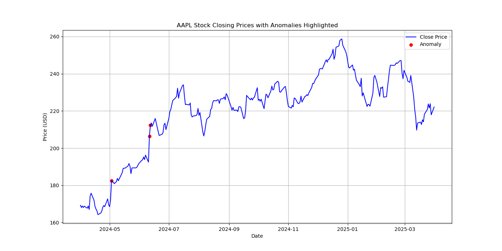

# 📈 Stock Price Anomaly Detection - AAPL (Apple Inc.)

This project performs anomaly detection on Apple Inc.'s (AAPL) stock price using Python.

## 🔍 What We Do

- Fetch historical stock data using `yfinance`
- Preprocess and visualize the closing price
- Apply the **Z-score method** for statistical anomaly detection
- Highlight anomalies directly on the stock price chart

## 📊 Libraries Used

- `yfinance`
- `pandas`
- `matplotlib`
- `numpy`

## 📌 Goal

To identify unusual spikes or drops in AAPL's stock price using basic statistical methods, which can serve as early indicators for further financial analysis or trading strategy development.

## 🚀 Getting Started

To run the notebook:

pip install yfinance pandas matplotlib numpy
